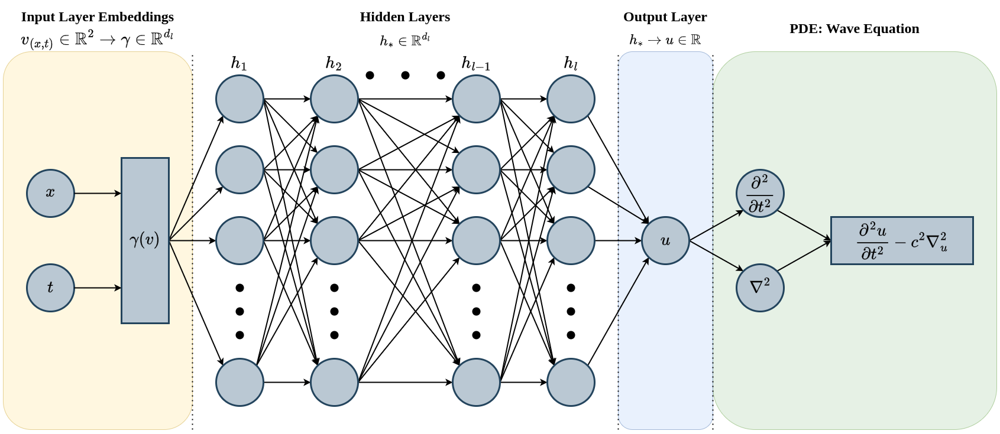

# Physics Informed Neural Networks (PINNs):
Employing Deep Neural Networks (DNNs), a multi-layer perceptron (MLP), to solve time dependent systems defined by laws of physics.

More specifically, MLP's automatic differentiation is utilized to differentiate with respect to input and model parameters, yielding a network that "respects" any principles from physical laws interwoven deep within a observed system often represented as a time dependent partial differential equation with the following form: 

$$ u_t  + {\cal N [u]}= 0, t\in [0,T],  x\in\Omega$$
With the following Inital and Boundary Condition:
$$ u(t,x)|_{t=0}= u(0,x)= g(x)$$ 
$${\cal B[u]}= 0$$

$u$ is the unknown hidden solution governed by the PDE, substituted with a neural network with the form $u_\theta(t,x)$, where $\theta$ are all the parameters of the linear combinations that models the neural network.

[More Information on the theory of PINNs](https://doi.org/10.1016/j.jcp.2018.10.045)

## One-Dimensional Wave Equation:
$$\frac{\partial^2u}{\partial t^2}= 4\nabla^2_u \implies \frac{\partial^2u}{\partial t^2} - 4 \frac{\partial^2u}{\partial x^2} = 0, x\in [0,1], t\in [0,1]$$

### Inital Conditions:
$$u(0,x)= g(x)= sin(\pi x)+ \frac{1}{2}sin(4\pi x), \frac{\partial u}{\partial t}(0,x)= f(x)= 0 $$ 

### Boundary Conditions:
$$u(t,0)= u(t,1)= h(t,x)= 0$$

### Exact Solution:
$$u(t, x)= sin(\pi x)cos(2\pi t)+ \frac{1}{2}sin(4\pi x)cos(8\pi t)$$

---
## MLP Implementation:

### [RFF](https://arxiv.org/pdf/2006.10739) Embeddings:
$$\gamma(v)=
\begin{bmatrix}
\cos(2\pi Bv) \\
\sin(2\pi Bv) \\
\end{bmatrix}, B \in \mathbb R^{2 \times\frac{d_l}{2}}$$

### L2 Loss:
$$\cal L(\theta)= L_{ic} + L_{bc} + L_{r}$$

$${\cal L_{ic}}(\theta)= \frac{1}{N_{ic}}\sum_{i=1}^{N_{ic}} \left|u_\theta(0, x^i_{ic}) - g(x^i_{ic})\right|^2$$

$${\cal L_{bc}}(\theta)= \frac{1}{N_{bc}}\sum_{i=1}^{N_{bc}} \left|h_\theta(t^i_{bc}, 0) - h_\theta(t^i_{bc}, 1)\right|^2$$

$${\cal L_{r}}(\theta)= \frac{1}{N_{r}}\sum_{i=1}^{N_{r}} \left|\frac{\partial u_\theta}{\partial t}(t^i_{r}, x^i_{r}) -4\frac{\partial^2 u_\theta}{\partial x^2}(t^i_{r}, x^i_{r})\right|^2$$

---
## Results

